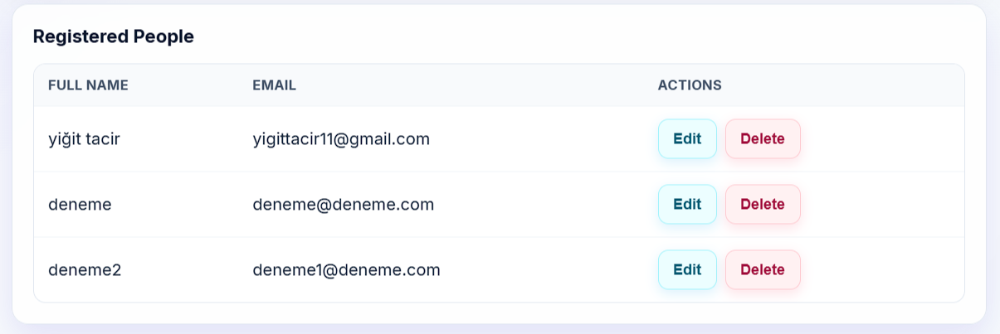

# Person Management System

## 📝 Project Description

This is a full-stack **Person Management System** developed as a web application. It allows users to register people, view a registered list, update existing records, and delete them. The project is fully containerized using Docker to ensure a consistent environment across different machines.

### Tech Stack

- **Frontend:** React (Vite)
- **Backend:** Node.js (Express)
- **Database:** PostgreSQL
- **Orchestration:** Docker Compose

---

## 🚀 Setup and Run Instructions

### Prerequisites

- Ensure **Docker** and **Docker Desktop** are installed and running on your machine.

### How to Run

1. Open a terminal in the project root directory (`person-management-system`).
2. Run the following command to build and start all services:
   ```bash
   docker compose up --build
   ```
3. Once the process is complete:

   Frontend UI: Access at http://localhost:5173

   Backend API: Running at http://localhost:5000

## API Endpoint Documentation

The backend API base path is /api. It handles full CRUD operations for the "people" table.

Method Endpoint Description Status Codes
GET /api/people Retrieve all registered people "200, 500"
GET /api/people/:id Retrieve a specific person by ID "200, 404, 500"
POST /api/people Register a new person "201, 400, 409, 500"
PUT /api/people/:id Update an existing person's details "200, 400, 404, 409, 500"
DELETE /api/people/:id Delete a record from the database "200, 404, 500"

## Backend Validation Rules

Email Format: Must be a valid email string (validated via Regex).
Unique Constraint: Emails must be unique; duplicate entries return a 409 Conflict error.
Required Fields: Full Name and Email are mandatory.

## Screenshots

### 1. Registration Form Page
   (Submit a new person here)


### 2. People List Page
   (View all registered records in the table)



### 3. CRUD Operations
   (Demonstration of Update/Delete functionality)


